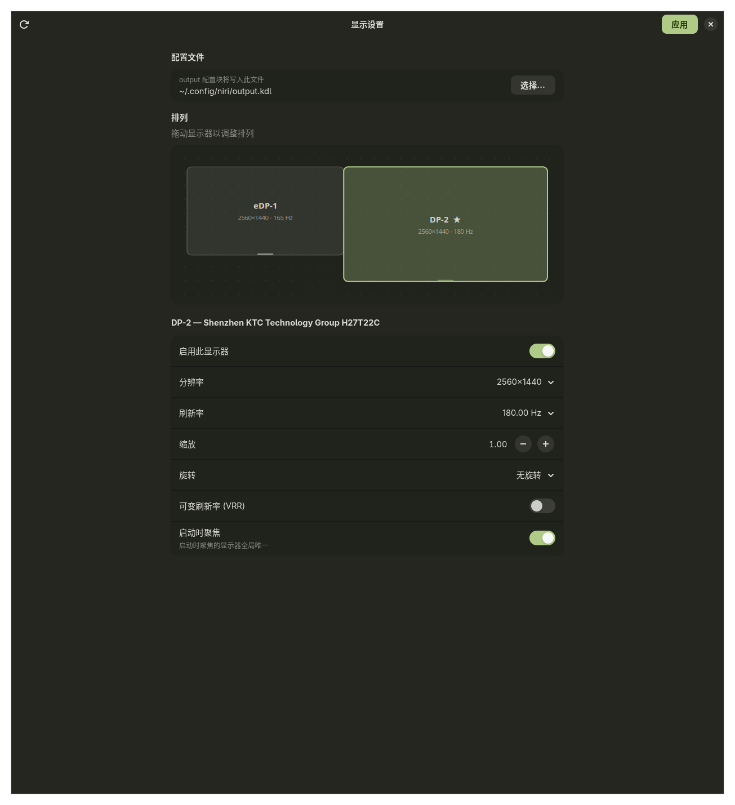

# niri-display-settings

一个专为 [niri](https://github.com/niri-wm/niri) 合成器设计的显示器设置 GUI，基于 GTK4 + libadwaita，零第三方 Python 依赖。

*A small GTK4/libadwaita GUI to configure monitors for the niri compositor. English section below.*



## 功能

- **拖拽排列显示器**：画布中直接拖动显示器方框调整位置，带边缘吸附与重叠检测
- **完整的输出设置**：分辨率、刷新率、缩放、旋转、VRR（含 on-demand 按需模式）、启用/禁用、启动时聚焦（focus-at-startup）
- **实时预览 + 倒计时确认**：点击"应用"先通过 `niri msg output` 做临时修改（不写文件），15 秒倒计时内确认才写入配置；超时或取消自动恢复——改错了也不会把屏幕搞坏
- **自动检测配置文件**：自动解析 `config.kdl` 的 `include` 闭包，找到 output 块所在的文件（无论是 `config.kdl` 本身还是拆分出的 `output.kdl`）；支持手动指定，未被 include 的文件会提示并可一键修复
- **外科手术式编辑**：只修改目标属性行，你手写的注释、缩进、格式、未知属性全部原样保留，绝不整体重新生成配置
- **安全写入**：写入前自动备份为 `*.bak`，并先在配置副本上运行 `niri validate` 预校验；校验失败不碰真实文件并显示 niri 的报错原因
- 界面跟随系统深浅色与主题高亮色（兼容 matugen 的 `~/.config/gtk-4.0/colors.css`）、中英文界面随系统语言切换

## 依赖

- niri（`include` 拆分配置需要 niri ≥ 25.11，直接写在 `config.kdl` 里则无版本要求）
- GTK4、libadwaita、PyGObject（Arch：`pacman -S gtk4 libadwaita python-gobject`，绝大多数桌面环境已自带）
- Python ≥ 3.11

## 安装

- Arch Linux

    ```
    yay -S niri-display-settings-git
    ```

- 手动

    ```bash
    git clone https://github.com/SHORiN-KiWATA/niri-display-settings.git
    cd niri-display-settings
    ./niri-display-settings
    ```

    安装到系统：

    ```bash
    pip install --user .
    # 可选：安装图标与桌面入口
    mkdir -p ~/.local/share/icons/hicolor/512x512/apps
    cp icons/niri-display-settings.png ~/.local/share/icons/hicolor/512x512/apps/
    cp io.github.shorin_kiwata.NiriDisplaySettings.desktop ~/.local/share/applications/
    ```

## 工作原理

1. 通过 `niri msg --json outputs` 读取当前显示器状态（连接器名、可用模式、VRR 支持等）
2. 解析 `~/.config/niri/config.kdl`（或 `$NIRI_CONFIG`）及其全部 `include` 文件，定位 `output` 配置块——同时支持连接器名（`DP-1`）和 `"厂商 型号 序列号"` 两种标识
3. 点击"应用"后先用 `niri msg output` 下发临时修改（niri 官方保证这类修改不写文件、配置重载即失效），弹出倒计时确认
4. 确认保留后：备份目标文件 → 把整个配置目录复制到临时目录、在副本上施加修改并 `niri validate` 预校验 → 通过后才写入真实文件，niri 随即热重载

## 测试

```bash
python tests/run.py
```

---

## English

A lightweight display settings GUI for the niri Wayland compositor. GTK4 + libadwaita, zero pip dependencies.

- Drag-to-arrange monitor canvas with edge snapping
- Mode / refresh rate / scale / transform / VRR (incl. on-demand) / enable / focus-at-startup
- Live preview via `niri msg output` (temporary, file untouched) with a 15-second revert countdown, GNOME-style
- Auto-detects which config file holds your `output` blocks by resolving the `include` closure of `config.kdl`; manual selection with one-click include repair
- Surgical config editing: only the target property lines change — your comments and formatting survive
- Backup (`*.bak`) + staged `niri validate` before touching the real config; errors are shown and nothing is written

Run `./niri-display-settings`, or `pip install --user .`.

## License

MIT
